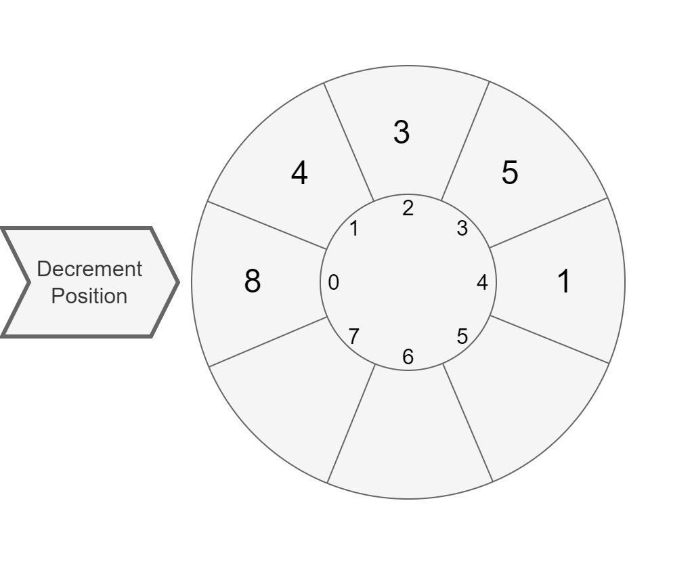

# Line Intersection

The purpose of this exercise is to train you to work with classes and methods.

Estimated workload of this exercise is _45 min_.

### Description

Please, implement the method `intersection(Line)` in class [`Line`](intersection/Line.java).
It  must return a [`Point`](intersection/Point.java) of intersection of two lines.

Note that lines are defined by linear equations: `y = k * x + b`.
Line constructor takes `k` and `b` coefficients as parameters.

If lines coincide or do not intersect, the method must return null.
It may seem surprising that we use `int` for arguments and fields of coordinates.
The point is that using `double` will bring some extra complexity we want to avoid for this basic exercise.
All tests are selected in to induce calculations without remainders.

You may check your result in class [`Main`](intersection/Main.java).

### Example

```java
public class Main {
    public static void main(String[] args) {
        Line line1 = new Line(1,1);
        Line line2 = new Line(-1,3);

        System.out.println(line1.intersection(line2)); // (1;2)
    }
}
```


# Segments

The purpose of this exercise is to train you to work with classes and methods.

Estimated workload of this exercise is _45 min_.

### Description
Please, implement the following methods of class [`Segment`](segment/Segment.java): 

* constructor with start and end points as parameters\
  Ensure that a created segment exists and is not degenerative 
  which means that the start and the end of the segment is not the same point.\
  If it is, use `throw new IllegalArgumentException()` to raise an error.
* `double length()`\
  Return length of the segment.
* `Point middle()`\
  Return a middle point of the segment.
* `Point intersection(Segment another)`\
  Return a point of the intersection of the current segment and the given one.\
  Return `null` if there is no such point.\
  Return `null` if segments are collinear.\
  Please, note that intersection point must lay on both segments.

Class [`Point`](segment/Point.java) is already there.

Hints:
* [Length reference](https://www.wikihow.com/Use-Distance-Formula-to-Find-the-Length-of-a-Line)
* [Midpoint reference](https://www.wikihow.com/Find-the-Midpoint-of-a-Line-Segment#Use-the-Midpoint-Formula)
* [Intersection reference](https://en.wikipedia.org/wiki/Line–line_intersection)
 
### Examples
You may use [Main](segment/Main.java) class to try your code.
There are some examples below.

---
Sample code:
```java
...
double length = new Segment(new Point(0, 0), new Point(3, 4)).length();
System.out.println(length);

```

Output: `5`

---
Sample code:
```java
...
Segment first = new Segment(new Point(0, 0), new Point(4, 4));
Segment second = new Segment(new Point(2, 0), new Point(0, 2));
Point intersection = first.intersection(second);

System.out.println(intersection.getX());
System.out.println(intersection.getY());

```

Output:

```
1
1
```
---
Sample code:
```java
...
Segment segment = new Segment(new Point(2, 0), new Point(0, 2));
Point midpoint = segment.middle();

System.out.println(midpoint.getX());
System.out.println(midpoint.getY());

```

Output:

```
1
1
```

---
Sample code:
```java
...
Segment first = new Segment(new Point(0, 0), new Point(4, 0));
Segment second = new Segment(new Point(2, 1), new Point(1, 2));
Point intersection = first.intersection(second);

System.out.println(intersection == null);

```

Output:

```
true
```

---


# Triangle

The purpose of this exercise is to train you to work with classes and methods.

Estimated workload of this exercise is _45 min_.

### Description

Please, implement methods of class [`Triangle`](triangle/Triangle.java):

* constructor, which has three points as parameters.\
  Consider these points as vertices of the triangle.\
  Ensure that the created triangle exists and it is not degenerative.\
  If it is, use `throw new IllegalArgumentException()` to raise an error.
* `double area()`\
  Return the area of the triangle.
* `Point centroid()`\
  Return the centroid of the triangle.

Class [`Point`](src/main/java/com/epam/rd/autotasks/triangle/Point.java) is already there.

Hints:
* [Triangle existence reference](https://en.wikipedia.org/wiki/Triangle#Existence_of_a_triangle)
* [Triangle area reference](https://en.wikipedia.org/wiki/Triangle#Computing_the_area_of_a_triangle)
* [Centroid reference](https://en.wikipedia.org/wiki/Centroid)

Please note that you may benefit from introducing more classes.
 
## Examples
You may use [Main](triangle/Main.java) class to try your code.
There are some examples below.
---
Sample code:
```java
...
new Triangle(new Point(0,0), new Point(1, 0), new Point(2, 0));
```

Result: Exception because such a triangle would be degenerative.

---
Sample code:
```java
...
double area = new Triangle(new Point(0,0), new Point(3, 0), new Point(0, 4)).area();
System.out.println(area);
```

Output:

```
6
```

---
Sample code:
```java
...
Point centroid = new Triangle(new Point(0,0), new Point(3, 0), new Point(0, 3)).centroid();

System.out.println(centroid.getX());
System.out.println(centroid.getY());
```

Output:

```
1
1
```


# Decrementing Carousel

The purpose of this exercise is to train you designing simple classes and their relations.

Estimated workload of this exercise is _2h_.

### Description

[`Decrementing Carousel`](decrementingcarousel/DecrementingCarousel.java) is a container, accepting `int` elements.
`DecrementingCarousel` has a maximum capacity, specified via the constructor.
When created, `DecrementingCarousel` is in accumulating state: you may add elements via the `addElement` method and can produce a [`CarouselRun`](decrementingcarousel/CarouselRun.java) object via the `run` method.
Once the `run` method is called, `DecrementingCarousel` is in running state: it refuses adding more elements.

The `CarouselRun` allows to iterate over elements of the carousel decrementing them one by one with the `next` method.
The `next` returns the value of the current element:



Then it decreases the current element by one and switches to the next element:


The `CarouselRun` iterates over elements in the order of their insertion.  
When an element is decreased to zero, the `CarouselRun` will skip it in further iterations.
When there are no more elements available for decrementing, the `CarouselRun` returns `-1`.

The `CarouselRun` also has the `isFinished` method, which indicates, if the carousel has run out of the lements to decrement.

### Specification Details
`DecrementingCarousel` has two public methods:
- `boolean addElement(int element)` - adds an element. 
  If element is negative or zero, do not add the element.
  If container is full, do not add the element.
  If the `run` method was called to create a `CarouselRun`, do not add the element.
  If element is added successfully, return `true`. Return `false` otherwise.
- `CarouselRun run()` - returns a `CarouselRun` to iterate over the elements.
  If the `run` method has already been called earlier, it must return `null`:
  `DecrementingCarousel` may generate only one `CarouselRun` object.

`CarouselRun` has two public methods:
- `int next()` - returns the current value of the current element, 
  then decreases the current element by one and switches to the next element in insertion order.
  Skips zero elements. When there is no more elements to decrease, returns `-1`.
- `boolean isFinished()` - when there is no more elements to decrease, returns `true`. Otherwise, returns `false`.

### Examples

Empty case:
```java
CarouselRun run = new DecrementingCarousel(7).run();
System.out.println(run.isFinished()); //true
System.out.println(run.next()); //-1
```

Regular case:
```java
DecrementingCarousel carousel = new DecrementingCarousel(7);

carousel.addElement(2);
carousel.addElement(3);
carousel.addElement(1);

CarouselRun run = carousel.run();

System.out.println(run.isFinished()); //false

System.out.println(run.next()); //2
System.out.println(run.next()); //3
System.out.println(run.next()); //1

System.out.println(run.next()); //1
System.out.println(run.next()); //2

System.out.println(run.next()); //1

System.out.println(run.isFinished()); //true
System.out.println(run.next()); //-1
```

Refusing adding more elements case:
```java
DecrementingCarousel carousel = new DecrementingCarousel(3);

System.out.println(carousel.addElement(-2)); //false
System.out.println(carousel.addElement(0)); //false
        
System.out.println(carousel.addElement(2)); //true
System.out.println(carousel.addElement(3)); //true
System.out.println(carousel.addElement(1)); //true

//carousel is full
System.out.println(carousel.addElement(2)); //false

CarouselRun run = carousel.run();

System.out.println(run.next()); //2
System.out.println(run.next()); //3
System.out.println(run.next()); //1

System.out.println(run.next()); //1
System.out.println(run.next()); //2

System.out.println(run.next()); //1

System.out.println(run.isFinished()); //true
System.out.println(run.next()); //-1
```

Refusing to add more elements after "run" was called:
```java
DecrementingCarousel carousel = new DecrementingCarousel(10);

System.out.println(carousel.addElement(2)); //true
System.out.println(carousel.addElement(3)); //true
System.out.println(carousel.addElement(1)); //true

carousel.run();

System.out.println(carousel.addElement(2)); //false
System.out.println(carousel.addElement(3)); //false
System.out.println(carousel.addElement(1)); //false
```

Refusing to create more than one CarouselRun:
```java
DecrementingCarousel carousel = new DecrementingCarousel(10);
System.out.println(carousel.run() == null); //false
System.out.println(carousel.run() == null); //true
```

